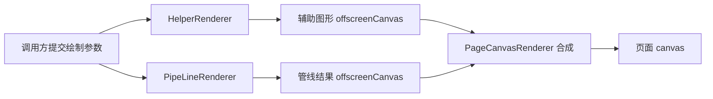
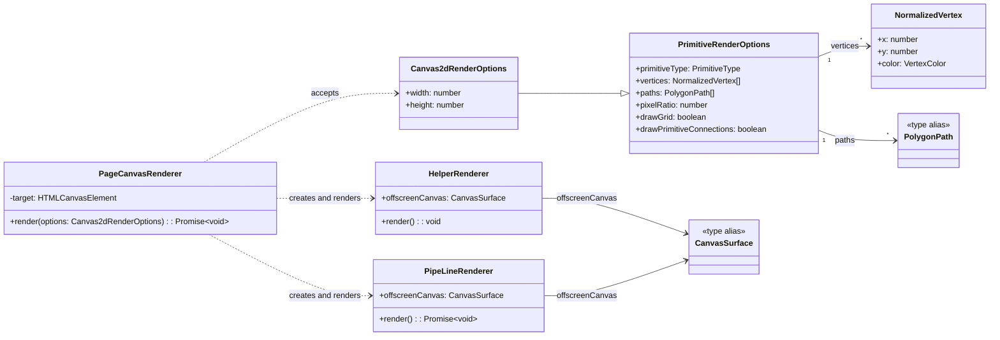

# Render Pipeline 设计总览

本文说明当前渲染器的职责划分、一次绘制的流程、核心数据，以及已实现的边界。当前使用 Canvas 2D；WebGL/WebGPU 仍是项目方向，不是现有能力。

## 职责划分



- `PageCanvasRenderer` 是唯一面向调用方的总入口。它确定目标尺寸、校验参数、创建并运行两个子渲染器，等待 Rust/WASM 管线完成后把结果合成到页面 canvas。
- `HelperRenderer` 只负责辅助图形，并将结果绘制到自己持有的 `offscreenCanvas`。
- `PipeLineRenderer` 只负责渲染管线的结果，并将结果绘制到自己持有的 `offscreenCanvas`。
- `PageCanvasRenderer` 按固定顺序将辅助画布绘制在下层、管线结果绘制在上层。
- 不使用通用 `Layer` 基类。每个渲染器直接持有完成自身工作所需的 canvas、上下文和尺寸；`canvas-surface.ts` 仅共享离屏 canvas/context 的创建逻辑。

## 类图



## 一次渲染

示例将页面 canvas 交给 `PageCanvasRenderer`，并传入参数：

```typescript
await new PageCanvasRenderer(canvas).render({
	width: 760,
	height: 460,
	primitiveType: 'triangle',
	vertices,
	pixelRatio: 20,
	drawGrid: true,
	drawPrimitiveConnections: true,
})
```

调用后按以下顺序执行：

1. `PageCanvasRenderer` 计算输出宽高并验证 `pixelRatio`。
2. 它创建 `HelperRenderer` 和 `PipeLineRenderer`，两者分别创建自己的离屏 canvas。
3. `HelperRenderer.render()` 绘制背景、光晕、可选网格和可选图元轮廓。
4. `PipeLineRenderer.render()` 加载共享的 Rust/WASM 实例，在 WASM 中预计算路径边并批量判断采样点覆盖，再由 TypeScript 插值颜色并绘制命中点。
5. 页面渲染器清空目标 canvas，依次绘制辅助画布和管线画布。

## 核心实体与代码位置

| 实体 | 职责 | 实现 |
| --- | --- | --- |
| `PageCanvasRenderer` | 总入口；尺寸处理、参数检查、子渲染器调度和页面合成。 | `page-canvas-renderer.ts` |
| `HelperRenderer` | 绘制辅助内容并持有辅助离屏画布。 | `helper-renderer.ts` |
| `PipeLineRenderer` | 调用 Rust/WASM 批量计算路径覆盖，插值颜色并持有结果离屏画布。 | `pipeline-renderer.ts`、`wasm/src/lib.rs` |
| `assemblePrimitivePaths` | 将图元顶点装配成多边形路径；显式 `paths` 可提供多个环与孔洞。 | `primitive-assembler.ts` |
| `createCanvasSurface` | 创建离屏画布及其 2D 上下文，不管理渲染生命周期或图层。 | `canvas-surface.ts` |
| `NormalizedVertex` | 归一化位置 `(x, y)` 与 RGB 颜色。 | `renderer-types.ts` |
| `PrimitiveRenderOptions` | 图元类型、顶点和辅助显示参数。 | `renderer-types.ts` |
| `Canvas2dRenderOptions` | 完整绘制参数，另含可选输出宽高。 | `renderer-types.ts` |

上述渲染器和参数类型由 `triangle.ts` 汇总导出。调用方只需使用 `PageCanvasRenderer`，无需直接创建子渲染器。

## 参数约定

| 参数 | 当前语义 |
| --- | --- |
| `width` / `height` | 可选输出尺寸；缺省时取目标 canvas 的 `width`，再取 `clientWidth`，最后回退到 `640 × 400`。 |
| `primitiveType` | 当前只支持 `'triangle'`。 |
| `vertices` | 三角形要求恰好 3 个顶点；`x`、`y` 按画布宽高比例解释。 |
| `paths` | 可选多边形路径；每个环是归一化坐标点数组，多个环按 even-odd 规则形成孔洞。缺省时由三角形顶点装配为一个路径。 |
| `color` | RGB 颜色；示例按 `0–255` 通道值传入，类型尚未限定通道或坐标范围。 |
| `pixelRatio` | CPU 采样步长，也用作辅助网格间距；不是设备像素比，必须为正的有限数值。 |
| `drawGrid` | 是否绘制辅助网格。 |
| `drawPrimitiveConnections` | 是否绘制辅助层上的图元填充和边线。 |

## 管线实现与范围

`PageCanvasRenderer` 调用 `assemblePrimitivePaths` 一次性将图元顶点转换为路径，并将同一份路径交给辅助层和管线层。未显式传入 `paths` 时，三角形的三个顶点依序构成一个闭合环；显式传入时可用多个环描述孔洞。

`PipeLineRenderer` 将路径坐标转换为画布坐标，限制包围区域到画布范围后，以 `pixelRatio` 为步长遍历采样网格。WASM 对所有路径边预计算垂直范围与斜率，再对整批采样点执行 even-odd 点内判定；每个采样点只写入一个覆盖字节。颜色仍由三角形三个顶点定义，命中点的重心插值变换在整次绘制中预计算并复用。因此，这仍是 CPU 光栅化，不是 GPU shader 或浏览器原生 GPU 管线。

### 多边形覆盖判定

这里判断采样点是否在多边形内部，而不是采样单元是否与多边形相交。网格步长为 `pixelRatio`；每个单元取中心作为采样点，例如单元左上角为 `(x, y)` 时，采样点 `P` 为 `(x + pixelRatio / 2, y + pixelRatio / 2)`。多个路径的所有边共同参与奇偶判定，绕序不影响结果；射线与路径边的交点每经过一次就翻转内部状态，因此内环自然形成孔洞。

落在任意路径边界上的采样点归入内部。与原三角形 Top-Left 规则不同，多边形覆盖不负责相邻独立图元之间的边界去重；若以后需要无缝拼接独立多边形，应在图元级别另行定义共享边归属规则。

对于命中点，TypeScript 使用预计算的三角形重心变换计算插值权重：

```text
wA = edgeA / area
wB = edgeB / area
wC = edgeC / area
wA + wB + wC = 1
```

TypeScript 用这三个权重对三角形顶点的 RGB 颜色做线性插值，再绘制采样点。浏览器只跨 JS/WASM 边界一次传入路径与网格参数，不会逐点调用 WASM。覆盖缓冲由每采样点三个 `Float64` 权重缩减为一个字节。

- 辅助和管线内容都绘制到独立离屏 canvas；环境支持 `OffscreenCanvas` 时使用它，否则使用 DOM canvas。
- 当前只实现三角形与 Canvas 2D，宽高、坐标范围和颜色通道范围没有完整校验。
- 示例在页面挂载时用固定尺寸和顶点绘制一次；更新内容需要调用方再次调用 `render()`。
- 后续加入 WebGL/WebGPU 时，应继续保持“总入口负责调度与合成，子渲染器负责各自输出”的职责边界；当前文档不将未来后端描述为已实现。
